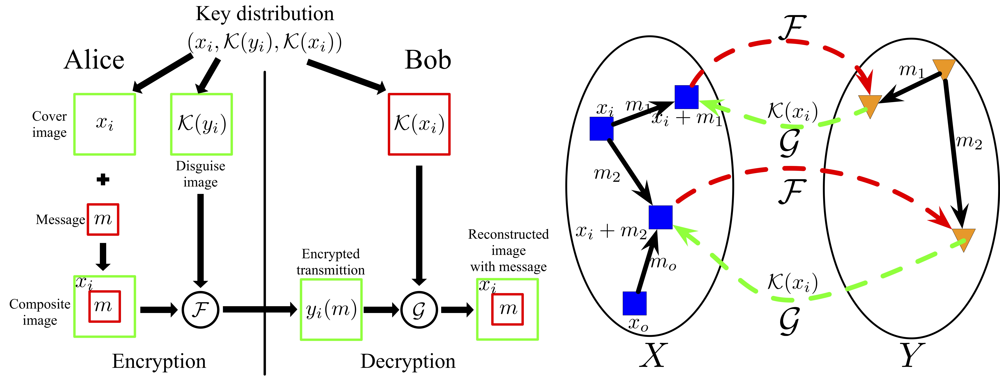
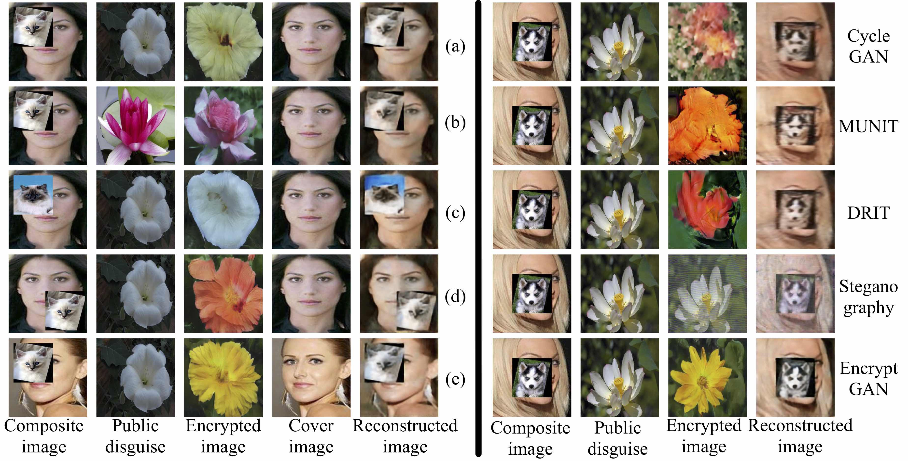
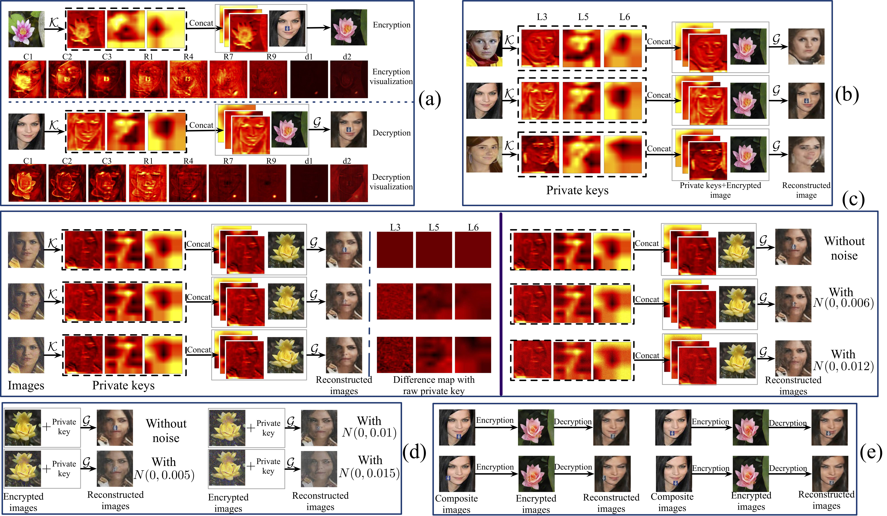

# EncryptGAN
## Introduction
EncryptGAN is a [Tensorflow](http://tensorflow.org/)-based framework for training and testing of **[EncryptGAN: Image Steganography with Domain Transform](https://arxiv.org/abs/1905.11582)**
## Installation
1. We use [Miniconda3](https://conda.io/miniconda.html) as the basic environment. If you installed the Miniconda3 in path `Conda_Path`, please install `tensorflow-gpu` using the command `Conda_Path/bin/conda install -c anaconda tensorflow-gpu==1.8`.
2. Install dependencies by `Conda_Path/bin/pip install -r requirements.txt` (if necessary). The `requirements.txt` file is provided in this package.

## Train
The training code will be released soon!

## Datasets
- 102Flowers
- CelebA
- Cat2dog

## EncryptGAN settings

## Results

### Complex image encryption

### Exploration of our EncryptGAN

### More results

### Asymmetric image encryption using private keys

